---

## 🌌 Who I Am

I'm **Shihab Shahriar Antor** — an **AI Engineer**, **full-stack developer**, and **founder of [Shahriar Labs](https://shahriarlabs.com)**, based in **Dhaka, Bangladesh**.

I design systems end-to-end, write production code, ship products, and think in architectures. Some people call that full-stack. I call it **owning the whole problem**.

---

## 🏗️ Shahriar Labs — The Core Universe

**Shahriar Labs** is my product studio and long-term experiment in building meaningful technology.

### 🚀 Active Products

<table>
<tr>
<td width="50%" valign="top">

### ✍️ [LetX](https://letx.app/)
**Real-time collaborative LaTeX platform**

Built for researchers, students, and teams who hate broken workflows. Write technical documents the way they should be written.

`LaTeX` `Real-time Collaboration` `Technical Writing`

</td>
<td width="50%" valign="top">

### 🎓 [QuantumSketch](http://quantumsketch.app/)
**AI-generated STEM visualization engine**

Turns raw concepts into structured animated explanations. Learning complex topics shouldn't feel like decoding ancient texts.

`AI Visualization` `Education` `STEM`

</td>
</tr>
<tr>
<td width="50%" valign="top">

### 🐯 [Bagh-Lang](http://bagh-beta.shahriarlabs.com/)
**Bangla-first programming language**

Teaching logic and creativity to kids before syntax fear kicks in. Code in your mother tongue.

`Programming Language` `Education` `Bangla`

</td>
<td width="50%" valign="top">

### 🧠 [Bikroy Buddy](http://bikroybuddy.com/)
**AI commerce agent for classifieds**

Automates conversations, lead qualification, and negotiations for marketplace sellers. Your 24/7 sales assistant.

`AI Agent` `E-commerce` `Automation`

</td>
</tr>
<tr>
<td colspan="2" valign="top">

### 🎨 [ComiKola](http://comikola.com/)
**Bangla webtoon platform & creative ecosystem**

Supporting indie artists and producing original stories through *ComiKola Originals*. This isn't a side project — it's culture tech inside Shahriar Labs.

`Webtoon` `Content Platform` `Creative Economy`

</td>
</tr>
</table>

---

## 🤖 Agent Skills & AI Tooling

Open-source skills and harnesses that make coding agents actually useful. Built for Claude Code, and portable across agents that follow the Agent Skills standard.

| Project | What it does |
| --- | --- |
| [**latex-engineer**](https://github.com/shihabshahrier/latex-engineer) | Turns an agent into a LaTeX engineer — generates, compiles, and debugs real projects |
| [**manim-coding-skill**](https://github.com/shihabshahrier/manim-coding-skill) | Teaching-quality STEM animation with ManimGL, chunked and merged into final video |
| [**skill-builder**](https://github.com/shihabshahrier/skill-builder) | Builds and audits agent skills from a plain-English description |
| [**common-knowledge**](https://github.com/shihabshahrier/common-knowledge) | Git-backed memory store shared across projects and agents |
| [**Godot-Skill**](https://github.com/shihabshahrier/Godot-Skill) | Strictly-typed GDScript 2.0 for Godot 4.3+, enforcing the official style guide |
| [**seo-master-skill**](https://github.com/shihabshahrier/seo-master-skill) | SEO + GEO + AEO playbook — ranking for search engines *and* answer engines |
| [**freelm**](https://github.com/shihabshahrier/freelm) | Always-up free-LLM client and gateway for Python and TypeScript |
| [**CH-Bench**](https://github.com/shihabshahrier/CH-Bench) | Apples-to-apples benchmark for AI memory and RAG — recall and answer quality |
| [**softco**](https://github.com/shihabshahrier/softco) | Turns coding agents into an autonomous software firm |
| [**clean-my-mac**](https://github.com/shihabshahrier/clean-my-mac) | Staged, consent-gated macOS disk cleanup for devs and agents |

---

## 📊 Signal

Cards are generated from the GitHub API by <a href="scripts/gen_cards.py">a script in this repo</a> and refreshed nightly — no third-party card service, nothing to 503 on me.

---

## 🔬 Research

Exoplanet detection using contrastive and detection-based ML:

- **Models:** SimCLR, Siamese Networks, YOLOv6/v7, DenseNet, ResNet50
- **Result:** 92% accuracy on astronomical imaging datasets
- **Focus:** contrastive learning for rare-event detection

I enjoy problems where data is messy, scale matters, and intuition counts as much as math.

---

## ⚙️ Tech Stack

### Languages

### Frameworks & Runtime

### AI & Infrastructure

---

## 🤝 Let's Build

Open to serious collaborations, research and product partnerships, and ambitious ideas that need structure rather than noise.

**If something here clicks, you already know the next move.**

*"I deploy what I design. No mystery handoffs."*

