# Shihab Shahriar Antor

**AI Engineer** · Founder of **[Shahriar Labs](https://shahriarlabs.com)** · Dhaka, Bangladesh

I design systems end-to-end and ship the products I design. Prior research: exoplanet detection with contrastive learning — 92% accuracy using SimCLR, Siamese networks and YOLO.

[LetX](https://letx.app/) · [QuantumSketch](http://quantumsketch.app/) · [Bagh-Lang](http://bagh-beta.shahriarlabs.com/) · [Bikroy Buddy](http://bikroybuddy.com/) · [ComiKola](http://comikola.com/)

 

[latex-engineer](https://github.com/shihabshahrier/latex-engineer) · [manim-coding-skill](https://github.com/shihabshahrier/manim-coding-skill) · [skill-builder](https://github.com/shihabshahrier/skill-builder) · [common-knowledge](https://github.com/shihabshahrier/common-knowledge) · [clean-my-mac](https://github.com/shihabshahrier/clean-my-mac) · [Godot-Skill](https://github.com/shihabshahrier/Godot-Skill) · [seo-master-skill](https://github.com/shihabshahrier/seo-master-skill) · [freelm](https://github.com/shihabshahrier/freelm) · [CH-Bench](https://github.com/shihabshahrier/CH-Bench) · [softco](https://github.com/shihabshahrier/softco)

 

 

[Portfolio](http://shihub.online/) · [Shahriar Labs](https://shahriarlabs.com/) · [LinkedIn](https://linkedin.com/in/shihabshahrier/) · [X](https://x.com/_shihabShahriar) · [Email](mailto:shihab@shahriarlabs.com)

